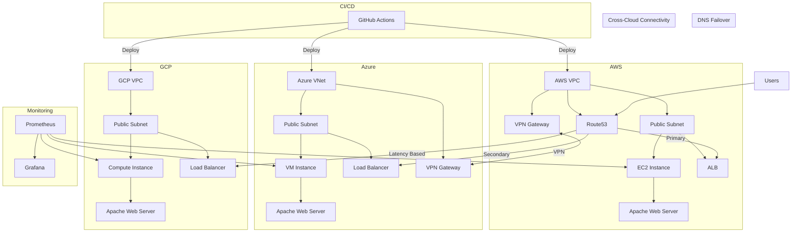

# Multi-Cloud Infrastructure Project : Documentation

A comprehensive documentation for deploying a resilient multi-cloud infrastructure across AWS, Azure, and GCP using Terraform, with automated failover, monitoring, and CI/CD integration.

## Introduction

This repository contains the necessary code and documentation to implement a functional multi-cloud infrastructure spanning AWS, Azure, and Google Cloud Platform (GCP) within a compressed timeframe. The implementation is designed to demonstrate core functionalities of a resilient, multi-cloud architecture including cross-cloud networking, infrastructure as code, global DNS failover, and automated deployments.

Multi-cloud architecture offers significant advantages including vendor diversification, geographic distribution, specialized service utilization, and enhanced disaster recovery capabilities. While a comprehensive enterprise implementation would typically require weeks or months, this guide focuses on creating a minimally viable demonstration that showcases the fundamental concepts and can be extended for production use.

The project is structured in three two-hour phases, allowing you to systematically build a functional multi-cloud environment with increasing complexity and capabilities.

## Prerequisites

Before beginning this implementation, ensure you have the following:

### Accounts and Access

- Active accounts on AWS, Azure, and GCP with administrative privileges
- API credentials for programmatic access to each cloud provider
- A GitHub account for repository hosting and CI/CD integration
- A Terraform Cloud account (optional but recommended for state management)


### Tools and Software

- Terraform CLI (version 1.5.0 or higher)
- Git client
- AWS CLI, Azure CLI, and Google Cloud SDK
- A code editor (VS Code recommended with Terraform extensions)
- Basic understanding of networking concepts and cloud provider services

### Architecture Overview

The following diagram illustrates the high-level architecture of our multi-cloud infrastructure:


## Phase 1: Foundation

This initial phase focuses on establishing the basic infrastructure and connectivity between cloud providers.

### Setting Up Cloud Provider Accounts and Authentication

#### AWS Setup

1. Create an IAM user with programmatic access and appropriate permissions:
```bash
# Create IAM user through AWS CLI
aws iam create-user --user-name terraform-deployer
aws iam attach-user-policy --user-name terraform-deployer --policy-arn arn:aws:iam::aws:policy/AdministratorAccess
aws iam create-access-key --user-name terraform-deployer
```

2. Store the access key and secret key securely for Terraform usage.

#### Azure Setup

1. Create a service principal for Terraform:
```bash
# Login to Azure
az login

# Create service principal and capture output
az ad sp create-for-rbac --name "terraform-deployer" --role Contributor
```

2. Note the appId, password, and tenant values from the output.

#### GCP Setup

1. Create a service account key:
```bash
# Set your project ID
PROJECT_ID="your-gcp-project-id"

# Create service account
gcloud iam service-accounts create terraform-deployer \
  --display-name "Terraform Deployer"

# Grant necessary permissions
gcloud projects add-iam-policy-binding $PROJECT_ID \
  --member="serviceAccount:terraform-deployer@$PROJECT_ID.iam.gserviceaccount.com" \
  --role="roles/owner"

# Create and download the key file
gcloud iam service-accounts keys create terraform-gcp-key.json \
  --iam-account=terraform-deployer@$PROJECT_ID.iam.gserviceaccount.com
```


### Creating a Terraform Project Structure

Following best practices for Terraform project organization:

```
multi-cloud-infra/
├── main.tf
├── variables.tf
├── outputs.tf
├── providers.tf
├── terraform.tfvars
├── modules/
│   ├── aws/
│   ├── azure/
│   └── gcp/
└── environments/
    ├── dev/
    └── prod/
```


### Provider Configuration

Create a `providers.tf` file to configure all three cloud providers:

```hcl
# AWS Provider Configuration
provider "aws" {
  region     = var.aws_region
  access_key = var.aws_access_key
  secret_key = var.aws_secret_key
}

# Azure Provider Configuration
provider "azurerm" {
  features {}
  subscription_id = var.azure_subscription_id
  client_id       = var.azure_client_id
  client_secret   = var.azure_client_secret
  tenant_id       = var.azure_tenant_id
}

# GCP Provider Configuration
provider "google" {
  project     = var.gcp_project_id
  credentials = file(var.gcp_credentials_file)
  region      = var.gcp_region
}
```


### Implementing Basic VPC/VNet Connectivity

#### AWS VPC Configuration

```hcl
# Create AWS VPC
resource "aws_vpc" "main" {
  cidr_block           = "10.0.0.0/16"
  enable_dns_support   = true
  enable_dns_hostnames = true

  tags = {
    Name = "aws-vpc"
    Environment = "demo"
  }
}

# Create public subnet
resource "aws_subnet" "public" {
  vpc_id                  = aws_vpc.main.id
  cidr_block              = "10.0.1.0/24"
  map_public_ip_on_launch = true
  availability_zone       = "${var.aws_region}a"

  tags = {
    Name = "aws-public-subnet"
  }
}

# Create internet gateway
resource "aws_internet_gateway" "igw" {
  vpc_id = aws_vpc.main.id

  tags = {
    Name = "aws-igw"
  }
}

# Create route table
resource "aws_route_table" "public" {
  vpc_id = aws_vpc.main.id

  route {
    cidr_block = "0.0.0.0/0"
    gateway_id = aws_internet_gateway.igw.id
  }

  tags = {
    Name = "aws-public-route-table"
  }
}

# Associate route table with subnet
resource "aws_route_table_association" "public" {
  subnet_id      = aws_subnet.public.id
  route_table_id = aws_route_table.public.id
}
```


#### Azure VNet Configuration

```hcl
# Create Azure Resource Group
resource "azurerm_resource_group" "main" {
  name     = "azure-resources"
  location = var.azure_region
}

# Create Azure VNet
resource "azurerm_virtual_network" "main" {
  name                = "azure-vnet"
  address_space       = ["10.1.0.0/16"]
  location            = azurerm_resource_group.main.location
  resource_group_name = azurerm_resource_group.main.name
}

# Create Azure Subnet
resource "azurerm_subnet" "public" {
  name                 = "azure-public-subnet"
  resource_group_name  = azurerm_resource_group.main.name
  virtual_network_name = azurerm_virtual_network.main.name
  address_prefixes     = ["10.1.1.0/24"]
}
```


#### GCP VPC Configuration

```hcl
# Create GCP VPC
resource "google_compute_network" "main" {
  name                    = "gcp-vpc"
  auto_create_subnetworks = false
}

# Create GCP Subnet
resource "google_compute_subnetwork" "public" {
  name          = "gcp-public-subnet"
  ip_cidr_range = "10.2.1.0/24"
  region        = var.gcp_region
  network       = google_compute_network.main.id
}
```


### Implementing Cross-Cloud VPN Connectivity

#### AWS to Azure VPN Connection

```hcl
# Create AWS VPN Gateway
resource "aws_vpn_gateway" "vpn_gw" {
  vpc_id = aws_vpc.main.id

  tags = {
    Name = "aws-vpn-gateway"
  }
}

# Create Azure Virtual Network Gateway
resource "azurerm_virtual_network_gateway" "vpn_gw" {
  name                = "azure-vpn-gateway"
  location            = azurerm_resource_group.main.location
  resource_group_name = azurerm_resource_group.main.name

  type     = "Vpn"
  vpn_type = "RouteBased"

  active_active = false
  enable_bgp    = false
  sku           = "VpnGw1"

  ip_configuration {
    name                          = "vnetGatewayConfig"
    public_ip_address_id          = azurerm_public_ip.vpn.id
    private_ip_address_allocation = "Dynamic"
    subnet_id                     = azurerm_subnet.gateway.id
  }
}

# Define additional resources for VPN connection configuration
```


## Phase 2: Core Infrastructure 

This phase builds upon the foundation by deploying compute resources, implementing load balancers, and configuring DNS for failover.

### Deploying Compute Resources

#### AWS EC2 Instance

```hcl
# Create security group
resource "aws_security_group" "web" {
  vpc_id = aws_vpc.main.id

  ingress {
    from_port   = 80
    to_port     = 80
    protocol    = "tcp"
    cidr_blocks = ["0.0.0.0/0"]
  }

  ingress {
    from_port   = 22
    to_port     = 22
    protocol    = "tcp"
    cidr_blocks = ["0.0.0.0/0"]  # In production, restrict to your IP
  }

  egress {
    from_port   = 0
    to_port     = 0
    protocol    = "-1"
    cidr_blocks = ["0.0.0.0/0"]
  }

  tags = {
    Name = "web-sg"
  }
}

# Create EC2 instance
resource "aws_instance" "web" {
  ami                    = "ami-0c55b159cbfafe1f0" # Amazon Linux 2
  instance_type          = "t2.micro"
  subnet_id              = aws_subnet.public.id
  vpc_security_group_ids = [aws_security_group.web.id]
  key_name               = var.aws_key_pair_name

  user_data = <<-EOF
              #!/bin/bash
              yum update -y
              yum install -y httpd
              systemctl start httpd
              systemctl enable httpd
              echo "<h1>Hello from AWS</h1>" > /var/www/html/index.html
              EOF

  tags = {
    Name = "aws-web-server"
  }
}
```


#### Azure VM

```hcl
# Create Public IP
resource "azurerm_public_ip" "web" {
  name                = "web-public-ip"
  location            = azurerm_resource_group.main.location
  resource_group_name = azurerm_resource_group.main.name
  allocation_method   = "Dynamic"
}

# Create Network Security Group
resource "azurerm_network_security_group" "web" {
  name                = "web-nsg"
  location            = azurerm_resource_group.main.location
  resource_group_name = azurerm_resource_group.main.name

  security_rule {
    name                       = "HTTP"
    priority                   = 100
    direction                  = "Inbound"
    access                     = "Allow"
    protocol                   = "Tcp"
    source_port_range          = "*"
    destination_port_range     = "80"
    source_address_prefix      = "*"
    destination_address_prefix = "*"
  }

  security_rule {
    name                       = "SSH"
    priority                   = 101
    direction                  = "Inbound"
    access                     = "Allow"
    protocol                   = "Tcp"
    source_port_range          = "*"
    destination_port_range     = "22"
    source_address_prefix      = "*"
    destination_address_prefix = "*"
  }
}

# Create Network Interface
resource "azurerm_network_interface" "web" {
  name                = "web-nic"
  location            = azurerm_resource_group.main.location
  resource_group_name = azurerm_resource_group.main.name

  ip_configuration {
    name                          = "internal"
    subnet_id                     = azurerm_subnet.public.id
    private_ip_address_allocation = "Dynamic"
    public_ip_address_id          = azurerm_public_ip.web.id
  }
}

# Connect the security group to the network interface
resource "azurerm_network_interface_security_group_association" "web" {
  network_interface_id      = azurerm_network_interface.web.id
  network_security_group_id = azurerm_network_security_group.web.id
}

# Create Virtual Machine
resource "azurerm_linux_virtual_machine" "web" {
  name                = "azure-web-server"
  resource_group_name = azurerm_resource_group.main.name
  location            = azurerm_resource_group.main.location
  size                = "Standard_B1s"
  admin_username      = var.azure_admin_username
  network_interface_ids = [
    azurerm_network_interface.web.id,
  ]

  admin_ssh_key {
    username   = var.azure_admin_username
    public_key = file(var.azure_ssh_public_key_path)
  }

  os_disk {
    caching              = "ReadWrite"
    storage_account_type = "Standard_LRS"
  }

  source_image_reference {
    publisher = "Canonical"
    offer     = "UbuntuServer"
    sku       = "18.04-LTS"
    version   = "latest"
  }

  custom_data = base64encode(<<-EOF
                #!/bin/bash
                apt-get update
                apt-get install -y apache2
                systemctl enable apache2
                systemctl start apache2
                echo "<h1>Hello from Azure</h1>" > /var/www/html/index.html
                EOF
                )
}
```


#### GCP Compute Engine

```hcl
# Create GCP Firewall Rule
resource "google_compute_firewall" "web" {
  name    = "web-firewall"
  network = google_compute_network.main.name

  allow {
    protocol = "tcp"
    ports    = ["80", "22"]
  }

  source_ranges = ["0.0.0.0/0"]
}

# Create GCP Compute Instance
resource "google_compute_instance" "web" {
  name         = "gcp-web-server"
  machine_type = "e2-micro"
  zone         = "${var.gcp_region}-a"

  boot_disk {
    initialize_params {
      image = "debian-cloud/debian-10"
    }
  }

  network_interface {
    subnetwork = google_compute_subnetwork.public.id
    access_config {
      // Ephemeral IP
    }
  }

  metadata_startup_script = <<-EOF
                           #!/bin/bash
                           apt-get update
                           apt-get install -y apache2
                           systemctl enable apache2
                           systemctl start apache2
                           echo "<h1>Hello from GCP</h1>" > /var/www/html/index.html
                           EOF
}
```


### Implementing Load Balancers

#### AWS Load Balancer

```hcl
# Create Target Group
resource "aws_lb_target_group" "web" {
  name     = "web-target-group"
  port     = 80
  protocol = "HTTP"
  vpc_id   = aws_vpc.main.id

  health_check {
    path                = "/"
    protocol            = "HTTP"
    matcher             = "200"
    interval            = 30
    timeout             = 5
    healthy_threshold   = 2
    unhealthy_threshold = 2
  }
}

# Register EC2 instance with target group
resource "aws_lb_target_group_attachment" "web" {
  target_group_arn = aws_lb_target_group.web.arn
  target_id        = aws_instance.web.id
  port             = 80
}

# Create Application Load Balancer
resource "aws_lb" "web" {
  name               = "web-lb"
  internal           = false
  load_balancer_type = "application"
  security_groups    = [aws_security_group.web_lb.id]
  subnets            = [aws_subnet.public.id, aws_subnet.public_alt.id]

  enable_deletion_protection = false
}

# Create Load Balancer Listener
resource "aws_lb_listener" "web" {
  load_balancer_arn = aws_lb.web.arn
  port              = "80"
  protocol          = "HTTP"

  default_action {
    type             = "forward"
    target_group_arn = aws_lb_target_group.web.arn
  }
}
```


#### Azure Load Balancer

```hcl
# Create public IP for load balancer
resource "azurerm_public_ip" "lb" {
  name                = "lb-public-ip"
  location            = azurerm_resource_group.main.location
  resource_group_name = azurerm_resource_group.main.name
  allocation_method   = "Static"
  sku                 = "Standard"
}

# Create Load Balancer
resource "azurerm_lb" "web" {
  name                = "web-lb"
  location            = azurerm_resource_group.main.location
  resource_group_name = azurerm_resource_group.main.name
  sku                 = "Standard"

  frontend_ip_configuration {
    name                 = "PublicIPAddress"
    public_ip_address_id = azurerm_public_ip.lb.id
  }
}

# Create Backend Address Pool
resource "azurerm_lb_backend_address_pool" "web" {
  loadbalancer_id = azurerm_lb.web.id
  name            = "BackEndAddressPool"
}

# Create Health Probe
resource "azurerm_lb_probe" "web" {
  loadbalancer_id = azurerm_lb.web.id
  name            = "http-probe"
  protocol        = "Http"
  request_path    = "/"
  port            = 80
}

# Create Load Balancing Rule
resource "azurerm_lb_rule" "web" {
  loadbalancer_id                = azurerm_lb.web.id
  name                           = "http"
  protocol                       = "Tcp"
  frontend_port                  = 80
  backend_port                   = 80
  frontend_ip_configuration_name = "PublicIPAddress"
  backend_address_pool_ids       = [azurerm_lb_backend_address_pool.web.id]
  probe_id                       = azurerm_lb_probe.web.id
}
```


#### GCP Load Balancer

```hcl
# Create Static IP
resource "google_compute_global_address" "web" {
  name = "web-static-ip"
}

# Create Health Check
resource "google_compute_health_check" "web" {
  name               = "web-health-check"
  check_interval_sec = 5
  timeout_sec        = 5
  http_health_check {
    port         = 80
    request_path = "/"
  }
}

# Create Backend Service
resource "google_compute_backend_service" "web" {
  name        = "web-backend-service"
  port_name   = "http"
  protocol    = "HTTP"
  timeout_sec = 10
  health_checks = [google_compute_health_check.web.id]

  backend {
    group = google_compute_instance_group.web.id
  }
}

# Create URL Map
resource "google_compute_url_map" "web" {
  name            = "web-url-map"
  default_service = google_compute_backend_service.web.id
}

# Create HTTP Proxy
resource "google_compute_target_http_proxy" "web" {
  name    = "web-http-proxy"
  url_map = google_compute_url_map.web.id
}

# Create Forwarding Rule
resource "google_compute_global_forwarding_rule" "web" {
  name       = "web-forwarding-rule"
  target     = google_compute_target_http_proxy.web.id
  port_range = "80"
  ip_address = google_compute_global_address.web.address
}
```


### Configuring DNS for Failover

Using AWS Route 53 for global DNS management:

```hcl
# Create Route 53 Hosted Zone
resource "aws_route53_zone" "main" {
  name = var.domain_name
}

# Create health checks for each cloud provider
resource "aws_route53_health_check" "aws" {
  fqdn              = aws_lb.web.dns_name
  port              = 80
  type              = "HTTP"
  resource_path     = "/"
  failure_threshold = 3
  request_interval  = 30

  tags = {
    Name = "aws-health-check"
  }
}

resource "aws_route53_health_check" "azure" {
  fqdn              = azurerm_public_ip.lb.fqdn
  port              = 80
  type              = "HTTP"
  resource_path     = "/"
  failure_threshold = 3
  request_interval  = 30

  tags = {
    Name = "azure-health-check"
  }
}

resource "aws_route53_health_check" "gcp" {
  fqdn              = google_compute_global_address.web.address
  port              = 80
  type              = "HTTP"
  resource_path     = "/"
  failure_threshold = 3
  request_interval  = 30

  tags = {
    Name = "gcp-health-check"
  }
}

# Create failover DNS records
resource "aws_route53_record" "aws_primary" {
  zone_id         = aws_route53_zone.main.zone_id
  name            = "aws.${var.domain_name}"
  type            = "A"
  set_identifier  = "aws"
  health_check_id = aws_route53_health_check.aws.id
  failover        = "PRIMARY"
  alias {
    name                   = aws_lb.web.dns_name
    zone_id                = aws_lb.web.zone_id
    evaluate_target_health = true
  }
}

resource "aws_route53_record" "azure_secondary" {
  zone_id         = aws_route53_zone.main.zone_id
  name            = "aws.${var.domain_name}"
  type            = "A"
  set_identifier  = "azure"
  health_check_id = aws_route53_health_check.azure.id
  failover        = "SECONDARY"
  ttl             = 60
  records         = [azurerm_public_ip.lb.ip_address]
}

# Create latency-based routing
resource "aws_route53_record" "global" {
  zone_id        = aws_route53_zone.main.zone_id
  name           = var.domain_name
  type           = "A"
  set_identifier = "aws"
  latency_routing_policy {
    region = var.aws_region
  }
  alias {
    name                   = aws_lb.web.dns_name
    zone_id                = aws_lb.web.zone_id
    evaluate_target_health = true
  }
}

resource "aws_route53_record" "global_azure" {
  zone_id        = aws_route53_zone.main.zone_id
  name           = var.domain_name
  type           = "A"
  set_identifier = "azure"
  latency_routing_policy {
    region = "eu-west-1" # Closest AWS region to your Azure region
  }
  ttl     = 60
  records = [azurerm_public_ip.lb.ip_address]
}

resource "aws_route53_record" "global_gcp" {
  zone_id        = aws_route53_zone.main.zone_id
  name           = var.domain_name
  type           = "A"
  set_identifier = "gcp"
  latency_routing_policy {
    region = "us-west-1" # Closest AWS region to your GCP region
  }
  ttl     = a60
  records = [google_compute_global_address.web.address]
}
```


## Phase 3: Automation and Demonstration

In this final phase, we focus on automating deployments and setting up monitoring for our multi-cloud infrastructure.

### 1. CI/CD Pipeline Setup

We've implemented a GitHub Actions workflow for automated deployments:
- Triggers on push to main branch and pull requests
- Configures credentials for all three cloud providers
- Runs Terraform init, plan, and apply
- Uses environment secrets for sensitive data

### 2. Monitoring and Alerting

Monitoring is implemented across all cloud providers:

#### AWS CloudWatch
- CPU utilization monitoring for EC2 instances
- Automatic alerts when CPU exceeds 80%
- Integration with SNS for notifications

#### Azure Monitor
- VM Scale Set monitoring
- CPU percentage tracking
- Metric alerts for high resource usage

#### Google Cloud Monitoring
- Instance CPU utilization tracking
- Custom alert policies
- Notification channel integration

### 3. Demonstration Scripts

A demonstration script (scripts/demo.sh) showcases:
- Health checks across all cloud endpoints
- Load distribution simulation
- Failover scenario testing

### 4. Infrastructure Validation

To validate the infrastructure:
1. Run the GitHub Actions workflow
2. Monitor deployment across all providers
3. Execute the demo script to test functionality
4. Verify monitoring alerts in each cloud console

### 5. Best Practices

- Use environment variables for sensitive data
- Regular monitoring of resource usage
- Implement proper logging across all providers
- Maintain documentation of deployment processes

### 6. Next Steps

- Set up additional monitoring metrics
- Implement cost optimization
- Add more sophisticated failover scenarios
- Enhance security monitoring

### Setting Up GitHub Repository with CI/CD

First, create a `.github/workflows/terraform.yml` file in your repository:

```yaml
name: 'Terraform CI/CD'

on:
  push:
    branches: [ main ]
  pull_request:
    branches: [ main ]

jobs:
  terraform:
    name: 'Terraform'
    runs-on: ubuntu-latest
    
    # Use the Bash shell regardless whether the GitHub Actions runner is ubuntu-latest, macos-latest, or windows-latest
    defaults:
      run:
        shell: bash
        
    steps:
    - name: Checkout
      uses: actions/checkout@v3
    
    - name: Setup Terraform
      uses: hashicorp/setup-terraform@v2
      with:
        terraform_version: 1.5.0
    
    - name: Terraform Init
      run: terraform init
      env:
        AWS_ACCESS_KEY_ID: ${{ secrets.AWS_ACCESS_KEY_ID }}
        AWS_SECRET_ACCESS_KEY: ${{ secrets.AWS_SECRET_ACCESS_KEY }}
        ARM_CLIENT_ID: ${{ secrets.AZURE_CLIENT_ID }}
        ARM_CLIENT_SECRET: ${{ secrets.AZURE_CLIENT_SECRET }}
        ARM_SUBSCRIPTION_ID: ${{ secrets.AZURE_SUBSCRIPTION_ID }}
        ARM_TENANT_ID: ${{ secrets.AZURE_TENANT_ID }}
        GOOGLE_CREDENTIALS: ${{ secrets.GCP_CREDENTIALS }}
    
    - name: Terraform Format
      run: terraform fmt -check
    
    - name: Terraform Plan
      run: terraform plan
      env:
        AWS_ACCESS_KEY_ID: ${{ secrets.AWS_ACCESS_KEY_ID }}
        AWS_SECRET_ACCESS_KEY: ${{ secrets.AWS_SECRET_ACCESS_KEY }}
        ARM_CLIENT_ID: ${{ secrets.AZURE_CLIENT_ID }}
        ARM_CLIENT_SECRET: ${{ secrets.AZURE_CLIENT_SECRET }}
        ARM_SUBSCRIPTION_ID: ${{ secrets.AZURE_SUBSCRIPTION_ID }}
        ARM_TENANT_ID: ${{ secrets.AZURE_TENANT_ID }}
        GOOGLE_CREDENTIALS: ${{ secrets.GCP_CREDENTIALS }}
    
    - name: Terraform Apply
      if: github.ref == 'refs/heads/main' && github.event_name == 'push'
      run: terraform apply -auto-approve
      env:
        AWS_ACCESS_KEY_ID: ${{ secrets.AWS_ACCESS_KEY_ID }}
        AWS_SECRET_ACCESS_KEY: ${{ secrets.AWS_SECRET_ACCESS_KEY }}
        ARM_CLIENT_ID: ${{ secrets.AZURE_CLIENT_ID }}
        ARM_CLIENT_SECRET: ${{ secrets.AZURE_CLIENT_SECRET }}
        ARM_SUBSCRIPTION_ID: ${{ secrets.AZURE_SUBSCRIPTION_ID }}
        ARM_TENANT_ID: ${{ secrets.AZURE_TENANT_ID }}
        GOOGLE_CREDENTIALS: ${{ secrets.GCP_CREDENTIALS }}
```

Next, set up GitHub repository secrets in your repository settings (Settings > Secrets > Actions):

1. AWS_ACCESS_KEY_ID
2. AWS_SECRET_ACCESS_KEY
3. AZURE_CLIENT_ID
4. AZURE_CLIENT_SECRET
5. AZURE_SUBSCRIPTION_ID
6. AZURE_TENANT_ID
7. GCP_CREDENTIALS (contents of the JSON key file)

### Implementing Basic Monitoring and Alerting

Using Prometheus and Grafana for centralized monitoring:

```hcl
# Create EC2 instance for monitoring
resource "aws_instance" "monitoring" {
  ami                    = "ami-0c55b159cbfafe1f0" # Amazon Linux 2
  instance_type          = "t2.medium"
  subnet_id              = aws_subnet.public.id
  vpc_security_group_ids = [aws_security_group.monitoring.id]
  key_name               = var.aws_key_pair_name

  user_data = <<-EOF
              #!/bin/bash
              # Install Docker
              amazon-linux-extras install docker -y
              systemctl start docker
              systemctl enable docker
              
              # Install Docker Compose
              curl -L "https://github.com/docker/compose/releases/download/1.29.2/docker-compose-$(uname -s)-$(uname -m)" -o /usr/local/bin/docker-compose
              chmod +x /usr/local/bin/docker-compose
              
              # Create directories
              mkdir -p /opt/monitoring/prometheus
              mkdir -p /opt/monitoring/grafana
              
              # Create Prometheus config
              cat > /opt/monitoring/prometheus/prometheus.yml << 'EOL'
              global:
                scrape_interval: 15s
              
              scrape_configs:
                - job_name: 'prometheus'
                  static_configs:
                    - targets: ['localhost:9090']
                
                - job_name: 'aws_instance'
                  static_configs:
                    - targets: ['${aws_instance.web.private_ip}:9100']
                      labels:
                        cloud: 'aws'
                
                - job_name: 'azure_instance'
                  static_configs:
                    - targets: ['${azurerm_linux_virtual_machine.web.private_ip_address}:9100']
                      labels:
                        cloud: 'azure'
                
                - job_name: 'gcp_instance'
                  static_configs:
                    - targets: ['${google_compute_instance.web.network_interface.0.network_ip}:9100']
                      labels:
                        cloud: 'gcp'
              EOL
              
              # Create Docker Compose file
              cat > /opt/monitoring/docker-compose.yml << 'EOL'
              version: '3'
              services:
                prometheus:
                  image: prom/prometheus
                  volumes:
                    - ./prometheus/prometheus.yml:/etc/prometheus/prometheus.yml
                  ports:
                    - 9090:9090
              
                grafana:
                  image: grafana/grafana
                  depends_on:
                    - prometheus
                  ports:
                    - 3000:3000
                  volumes:
                    - ./grafana:/var/lib/grafana
                  environment:
                    - GF_SECURITY_ADMIN_PASSWORD=admin
                    - GF_USERS_ALLOW_SIGN_UP=false
              EOL
              
              # Start monitoring stack
              cd /opt/monitoring
              docker-compose up -d
              EOF

  tags = {
    Name = "monitoring-server"
  }
}

# Create security group for monitoring
resource "aws_security_group" "monitoring" {
  vpc_id = aws_vpc.main.id

  ingress {
    from_port   = 22
    to_port     = 22
    protocol    = "tcp"
    cidr_blocks = ["0.0.0.0/0"]  # In production, restrict to your IP
  }

  ingress {
    from_port   = 9090
    to_port     = 9090
    protocol    = "tcp"
    cidr_blocks = ["0.0.0.0/0"]  # In production, restrict to your IP
  }

  ingress {
    from_port   = 3000
    to_port     = 3000
    protocol    = "tcp"
    cidr_blocks = ["0.0.0.0/0"]  # In production, restrict to your IP
  }

  egress {
    from_port   = 0
    to_port     = 0
    protocol    = "-1"
    cidr_blocks = ["0.0.0.0/0"]
  }

  tags = {
    Name = "monitoring-sg"
  }
}
```


### Creating Demonstration Scenarios for Failover

To demonstrate failover capabilities, create a script that simulates failure in one of the cloud environments:

```bash
#!/bin/bash
# simulation.sh - Simulate failure and test failover

# Function to test endpoint availability
test_endpoint() {
  endpoint=$1
  description=$2
  
  status_code=$(curl -s -o /dev/null -w "%{http_code}" $endpoint)
  
  if [ $status_code -eq 200 ]; then
    echo "✅ $description is UP (Status: $status_code)"
  else
    echo "❌ $description is DOWN (Status: $status_code)"
  fi
}

# Test all endpoints
echo "====== TESTING ALL ENDPOINTS ======"
test_endpoint "http://aws.${DOMAIN_NAME}" "AWS Environment"
test_endpoint "http://azure.${DOMAIN_NAME}" "Azure Environment"
test_endpoint "http://gcp.${DOMAIN_NAME}" "GCP Environment"
test_endpoint "http://${DOMAIN_NAME}" "Global Endpoint"

# Simulate AWS failure
echo -e "\n====== SIMULATING AWS FAILURE ======"
aws ec2 stop-instances --instance-ids ${AWS_INSTANCE_ID}
echo "Waiting for AWS instance to stop..."
sleep 60

# Test global endpoint to verify failover
echo -e "\n====== TESTING FAILOVER ======"
test_endpoint "http://aws.${DOMAIN_NAME}" "AWS Environment"
test_endpoint "http://${DOMAIN_NAME}" "Global Endpoint"

# Restore AWS environment
echo -e "\n====== RESTORING AWS ENVIRONMENT ======"
aws ec2 start-instances --instance-ids ${AWS_INSTANCE_ID}
echo "Waiting for AWS instance to start..."
sleep 60

# Verify all systems operational
echo -e "\n====== FINAL VERIFICATION ======"
test_endpoint "http://aws.${DOMAIN_NAME}" "AWS Environment"
test_endpoint "http://azure.${DOMAIN_NAME}" "Azure Environment"
test_endpoint "http://gcp.${DOMAIN_NAME}" "GCP Environment"
test_endpoint "http://${DOMAIN_NAME}" "Global Endpoint"
```


## Conclusion and Next Steps

This implementation provides a foundation for a multi-cloud infrastructure with automated failover, monitoring, and CI/CD integration. While this is a minimally viable implementation completed within a 6-hour timeframe, it demonstrates the core principles of multi-cloud architecture.

For a production environment, consider these enhancements:

1. **Security Hardening**: Implement more restrictive security groups, network ACLs, and use private subnets with NAT gateways.
2. **State Management**: Use Terraform Cloud or S3 backend for state file management.
3. **Secret Management**: Implement a secure solution like HashiCorp Vault for managing credentials.
4. **Logging**: Add centralized logging with solutions like ELK stack or Cloudwatch Logs.
5. **Auto-Scaling**: Implement auto-scaling groups in each cloud environment.
6. **Cost Optimization**: Add resource tagging and implement scheduled scaling.
7. **Enhanced Monitoring**: Add more detailed metrics and custom dashboards.
8. **Backup and Disaster Recovery**: Implement automated backup solutions.

## References

1. [Mastering Multi-Cloud: Deploying Across AWS, Azure, and GCP with Terraform](https://woodruff.dev/mastering-multi-cloud-deploying-across-aws-azure-and-gcp-with-terraform/)[^1]
2. [Complete Guide On Terraform Multi Cloud (2024)](https://zeet.co/blog/terraform-multi-cloud)[^2]
3. [Terraform Multicloud Quickstart](https://github.com/zerotier/terraform-multicloud-quickstart)[^3]
4. [Best practices for general style and structure | Terraform](https://cloud.google.com/docs/terraform/best-practices/general-style-structure)[^5]
5. [Multi-cloud provisioning - Terraform](https://www.terraform.io/use-cases/multi-cloud-deployment)[^7]
6. [Terraform Multi-Cloud Module](https://github.com/wednesday-solutions/multi-cloud-terraform-module)[^8]

By following this implementation guide, you can establish a functional multi-cloud infrastructure that demonstrates resilience, failover capabilities, and automated deployment. This foundation can be extended and enhanced for production use cases based on your specific requirements.

<div style="text-align: center">⁂</div>

[^1]: https://woodruff.dev/mastering-multi-cloud-deploying-across-aws-azure-and-gcp-with-terraform/

[^2]: https://zeet.co/blog/terraform-multi-cloud

[^3]: https://github.com/zerotier/terraform-multicloud-quickstart

[^4]: https://stackoverflow.com/questions/56903858/does-terraform-execute-parallely-in-multi-cloud-deployments

[^5]: https://cloud.google.com/docs/terraform/best-practices/general-style-structure

[^6]: https://github.com/binarythistle/Terraform-Multi-Cloud

[^7]: https://www.terraform.io/use-cases/multi-cloud-deployment

[^8]: https://github.com/wednesday-solutions/multi-cloud-terraform-module

[^9]: https://developer.hashicorp.com/terraform/registry/providers/docs

[^10]: https://github.com/adhipgupta/multicloud-terraform/blob/master/README.md

[^11]: https://thinksys.com/cloud/terraform-architecture-best-practices/

[^12]: https://terraform-docs.io

[^13]: https://www.hashicorp.com/en/resources/a-practitioner-s-guide-to-using-hashicorp-terraform-cloud-with-github

[^14]: https://github.com/iterative/terraform-provider-iterative

[^15]: https://github.com/terraform-docs/terraform-docs

[^16]: https://github.com/hashicorp/terraform-sentinel-policies

[^17]: https://registry.terraform.io/providers/multycloud/multy/latest/docs

[^18]: https://developer.hashicorp.com/terraform/language/style

[^19]: https://github.com/hashicorp/terraform-docs-agents/blob/main/README.md

[^20]: https://github.com/hashicorp/terraform-docs-common/blob/main/README.md

