# Multi-Cloud Terraform Infrastructure

A production-ready multi-cloud infrastructure implementation using Terraform, spanning AWS, Azure, and GCP with automated failover, monitoring, and CI/CD integration.

## 🌟 Features

- Multi-cloud deployment across AWS, Azure, and GCP
- Automated failover and load balancing
- Centralized monitoring and logging
- CI/CD integration with GitHub Actions
- Infrastructure as Code using Terraform
- Comprehensive security controls

## 📚 Documentation

Detailed documentation is available in our [Documentation Guide](Documentation.md).

## 🎥 Demonstrations & Reports

### Infrastructure Visualization
  - Architecture Diagram

```mermaid
graph TB
    subgraph "AWS ☁️"
        A[AWS VPC 🌐] --> A1[Public Subnet 📡]
        A1 --> A2[EC2 Instance 🖥️]
        A1 --> A3[ALB ⚖️]
        A --> A4[VPN Gateway 🔗]
        A2 --> A5[Apache Web Server 🌎]
        A --> A6[Route53 🌍]
    end

    subgraph "Azure ☁️"
        B[Azure VNet 🌐] --> B1[Public Subnet 📡]
        B1 --> B2[VM Instance 🖥️]
        B1 --> B3[Load Balancer ⚖️]
        B --> B4[VPN Gateway 🔗]
        B2 --> B5[Apache Web Server 🌎]
    end

    subgraph "GCP ☁️"
        C[GCP VPC 🌐] --> C1[Public Subnet 📡]
        C1 --> C2[Compute Instance 🖥️]
        C1 --> C3[Load Balancer ⚖️]
        C2 --> C5[Apache Web Server 🌎]
    end

    subgraph "Monitoring 📊"
        M1[Prometheus 📈] --> M2[Grafana 📊]
        M1 --> A2
        M1 --> B2
        M1 --> C2
    end

    subgraph "DNS Failover 🌍"
        A6 --> |Primary|A3
        A6 --> |Secondary|B3
        A6 --> |Latency Based|C3
    end

    subgraph "Cross-Cloud Connectivity 🔄"
        A4 <--> |VPN|B4
    end

    subgraph "CI/CD 🚀"
        G1[GitHub Actions 💻] --> |Deploy|A
        G1 --> |Deploy|B
        G1 --> |Deploy|C
    end

    U[Users 👥] --> A6
```

  - Cloud Network Topologies
  - VPC/VNet Configurations
  - DNS Management Flow
  - Security Group Mappings

## 🚀 Quick Start

1. Clone the repository:
```bash
git clone https://github.com/codecat1111/multi-cloud-terraform.git
